  

  
  
  
  

  

### `$ cat /var/log/experience.log --verbose`

**IT Automation Specialist, Asurepoint LLC** (Jun 2026-now)
- Write and maintain automation scripts in Python, Bash, and PowerShell to eliminate manual system administration tasks.
- Design automated ETL processes to extract, transform, and move data between disparate systems.
- Integrate software platforms via API keys and tokens, and configure webhooks for real-time cross-system actions.
- Build secure digital pipelines enabling legacy on-premise systems to communicate seamlessly with modern cloud applications.

**Application Developer, Asurepoint LLC** (Jun 2026-now)
- Design, develop, and maintain software applications in C#, Java, and Python to meet business and user requirements.
- Write clean, well-documented code and debug, test, and troubleshoot applications for performance and reliability.
- Collaborate with team members and stakeholders to gather requirements and translate them into technical solutions.
- Enhance existing applications by integrating new features and resolving software defects.

**IT Data Management Intern, Mississippi Department of Marine Resources** (Summer 2024)
- Gathered statistical data and organized legal records from archived case files.
- Produced geospatial maps from satellite imagery and state site data using ArcGIS software.

**Plumbing Apprentice, H&H Plumbing** (2019-2022)
- Installed piping systems (PVC, copper, PEX, cast iron) and fixtures including toilets, sinks, faucets, and water heaters.
- Secured and prepared pipes for cutting, threading, and soldering, and applied sealants, tape, and fittings.
- Tested systems for leaks and proper pressure to ensure code compliance and reliability.

### `$ ls -la /opt`

| project | what | stack |
| --- | --- | --- |
| **multi-agent-ai/** | Senior capstone with Fivos Health: a multi-agent AI system that harvests medical device data from the web and validates it against the FDA GUDID database, using a modular "Collect and Compare" workflow that learns from human review. | Python 3.13, FastAPI, Playwright, BeautifulSoup4, MongoDB Atlas, Ollama, Docker Compose, bcrypt, OWASP ZAP |
| **cyber-carver/** | Cyber Carver: a data-carving engine with its own browser-based GUI, launched from a link when the app is run with Python, that parses video, data, and configuration files from IoT devices (Ring doorbell cameras, smart home hubs). Disk images extracted from storage media with Kali Linux and FTK Imager are uploaded into the engine, carved files are assigned forensic hashes, and carved files, archives, and disk images are stored in a local PostgreSQL database. Containerized with Docker so it runs on anyone's OS, not just the local host. | Python 3.13, JavaScript, HTML, hashing libraries, PostgreSQL, Docker, Kali Linux, FTK Imager |
| **portal-resilience/** | Consolidated Asurepoint Insurance Group's fragmented toolset (Google Sheets, Apps Script, GoHighLevel, EnrollHere) into one HIPAA-compliant web portal with role-based access, and hardened the data layer with encrypted, immutable backups. | PostgreSQL, AWS S3 (versioning, Object Lock), Render |
| **app-dev-coursework/** | Applications built across intermediate and advanced application development, plus Linux forensics work inspecting hidden files and decrypting disk partitions on virtual machines. | C#, Java, Bash, Linux |

<code>$ cat /opt/multi-agent-ai/stack.txt</code>

- **language:** Python 3.13
- **web:** FastAPI with Jinja2 templates
- **browser automation:** Playwright running on asyncio
- **html parsing:** BeautifulSoup4 with the lxml parser
- **ai extraction:** Gemma 4 E4B, Mistral Large, Llama 3.3 70B, Llama 3.1 8B
- **database:** MongoDB Atlas
- **validation source:** FDA GUDID API v3
- **authentication:** bcrypt at work factor 12, plus a Have I Been Pwned check on new passwords
- **containers:** Docker Compose running the app, Ollama, and an init sidecar, with an opt-in GPU override
- **dev tools:** VS Code, GitHub, OWASP ZAP

### `$ ls /usr/bin /usr/lib/forensics /mnt/cloud /usr/share/systems`

- **bin:** Python, JavaScript, C#, Java, Bash, PowerShell
- **lib/forensics:** FTK Imager, Autopsy, EnCase, Wireshark, hex editors, data/file carving, Kali Linux
- **/mnt/cloud:** AWS, Google Cloud, PostgreSQL, MongoDB, data migration, HIPAA compliance
- **share/systems:** Linux, Windows/NTFS, macOS, VM environments, GitHub, ArcGIS

### `$ cat /etc/education`

**University of South Alabama:** B.S. Information Technology, Digital Forensics Concentration (May 2026)

### `$ history | grep honors`

- **Dean's List,** University of South Alabama (Spring 2025-Spring 2026)
- **Member,** The National Society of Leadership and Success (NSLS)
